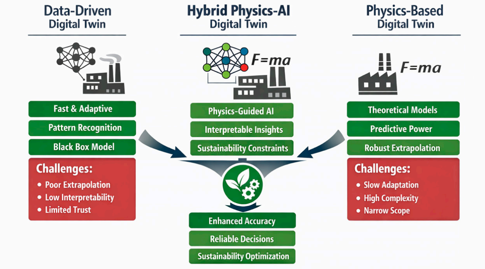

# Digital Twin Classification — IV. Classification by Modeling Approach

## Overview

A **Digital Twin** is a dynamic, virtual representation of a physical asset, system, or process. Beyond classifying digital twins by their maturity or data integration levels (e.g., Digital Model, Digital Shadow, Digital Twin, Predictive Twin), they can also be categorized based on **how their underlying digital behavior is constructed**.

The **modeling approach** determines how data, physics, algorithms, and domain knowledge are combined to simulate, monitor, and predict the state of the physical system. Digital twins generally fall into three core modeling approaches:

1. **Physics-Based (First-Principles) Twins**
2. **Data-Driven (AI/ML) Twins**
3. **Hybrid Digital Twins**

## Classification of Modeling Approaches

### 1. Physics-Based Twins (First-Principles)

* **Modeling Mechanism:** Driven by physical laws, mathematical equations, structural mechanics, fluid dynamics, and thermodynamics (e.g., Finite Element Analysis [FEA], Computational Fluid Dynamics [CFD], kinematic models).

* **Key Characteristics:**

* Built from explicit analytical equations and domain engineering principles.

* Does not rely on extensive historical operational data to make initial predictions.

* Highly transparent ("white-box" model) and fully interpretable.

* **Best Suitable For:** System design, structural integrity testing, thermal simulation, stress-strain analysis, and early-stage CAD prototyping.

* **Limitations:** High computational overhead; real-time execution can be challenging for complex systems without reduced-order modeling (ROM).

### 2. Data-Driven Twins (Data-Centric / AI / ML)

* **Modeling Mechanism:** Driven by operational data, time-series telemetry, sensor readings, and statistical/machine learning algorithms (e.g., Neural Networks, Deep Reinforcement Learning, Random Forests, Autoencoders).

* **Key Characteristics:**

* Learns system behavior directly from real-time and historical sensor data.

* Captures complex, non-linear relationships that are difficult to model mathematically.

* Operates as a "black-box" or "grey-box" model where decisions rely on data correlations.

* **Best Suitable For:** Anomaly detection, predictive maintenance, fault diagnosis, and dynamic pattern recognition.

* **Limitations:** Requires large, clean, high-frequency historical datasets; struggles to predict behavior under operational conditions not present in training data.

### 3. Hybrid Digital Twins (Physics-Informed AI / Physics-Guided ML)

* **Modeling Mechanism:** Combines first-principles physical models with machine learning algorithms (e.g., Physics-Informed Neural Networks [PINNs]).

* **Key Characteristics:**

* Uses physical constraints (e.g., energy conservation, momentum) to guide and regularize machine learning training.

* Uses AI/ML to approximate unmodeled physical friction, wear, or ambient environmental noise in real time.

* Balances model accuracy, real-time inference latency, and data dependency.

* **Best Suitable For:** Complex cyber-physical systems, dynamic energy grid management, health monitoring in Wireless Body Area Networks (WBANs), and predictive asset life cycle optimization.

* **Limitations:** High development complexity requiring expertise in both data science and domain physics.

## Comparison Matrix

| Feature / Dimension | Physics-Based Twin | Data-Driven Twin | Hybrid Digital Twin |
| --- | --- | --- | --- |
| **Primary Basis** | Physical laws & equations | Historical & sensor data | Physics laws + Machine Learning |
| **Interpretability** | High (White-box) | Low to Medium (Black/Grey-box) | Medium to High (Physics-guided) |
| **Data Dependency** | Low (Requires structural params) | High (Requires large telemetry datasets) | Balanced (Physically bounded) |
| **Computational Overhead** | High (CFD/FEA solver intensive) | Low-Medium (Inference time) | Optimized (Uses Reduced-Order Models) |
| **Real-Time Capability** | Challenging without ROM | Excellent (Fast ML inference) | Excellent for real-time edge/TinyML |
| **Unseen Scenario Handling** | Strong (Based on physical limits) | Weak (Fails outside training bounds) | Strong (Constrained by physics) |

## Summary & Implementation Considerations

* Choose **Physics-Based Twins** during the **design, prototyping, and CAD validation** phases.

* Choose **Data-Driven Twins** when physical dynamics are too complex to formulate mathematically, but **dense sensor telemetry** is readily available.

* Choose **Hybrid Twins** for **real-time edge systems and predictive intelligence** (e.g., TinyML deployments on microcontrollers, dynamic network control, and healthcare monitoring) to achieve real-time latency while retaining physical boundaries.

This infographic compares three distinct modeling paradigms for **Digital Twins**—Data-Driven, Physics-Based, and Hybrid Physics-AI—highlighting how combining data and physical laws overcomes the limitations of using either approach alone.

### 1. Data-Driven Digital Twin (Left)

Relies on machine learning algorithms, deep neural networks, and historical sensor telemetry to model behavior.

**Key Advantages:**

* **Fast & Adaptive:** Quick execution and real-time responsiveness.

* **Pattern Recognition:** Excels at recognizing trends, correlations, and anomalies in complex datasets.

* **Black Box Model:** Learns directly from empirical data without requiring mathematical equations.

**Challenges:**

* **Poor Extrapolation:** Struggles to accurately predict states outside its training data bounds.

* **Low Interpretability:** Opaque decision-making reasoning ("black box").

* **Limited Trust:** Difficult to verify safety or correctness in critical operations.

### 2. Physics-Based Digital Twin (Right)

Relies on physical principles, mathematical laws ($F = ma$), structural mechanics, and first-principles modeling.

**Key Advantages:**

* **Theoretical Models:** Built on proven mathematical and physical laws.

* **Predictive Power:** High accuracy based on system mechanics.

* **Robust Extrapolation:** Accurately models unobserved operating conditions by adhering to physical boundaries.

**Challenges:**

* **Slow Adaptation:** Difficult to adjust dynamically to real-world wear, noise, or environmental shifts.

* **High Complexity:** Computationally intensive to solve in real time.

* **Narrow Scope:** Limited to features explicitly modeled by physics equations.

### 3. Hybrid Physics-AI Digital Twin (Center)

Merges data-driven machine learning with physics-based constraints to capture the strengths of both approaches while eliminating their individual drawbacks.

**Core Mechanisms:**

* **Physics-Guided AI:** Incorporates physical laws as boundaries or regularization terms during neural network training.

* **Interpretable Insights:** Combines data predictions with physical explainability.

* **Sustainability Constraints:** Integrates energy, resource, and operating limits into decision loops.

**Combined Outcomes:**

* **Enhanced Accuracy:** Combines flexible pattern recognition with physical ground truth.

* **Reliable Decisions:** Ensures AI outputs never violate physical laws or safety thresholds.

* **Sustainability Optimization:** Enables continuous, efficient real-time monitoring and dynamic system control.
