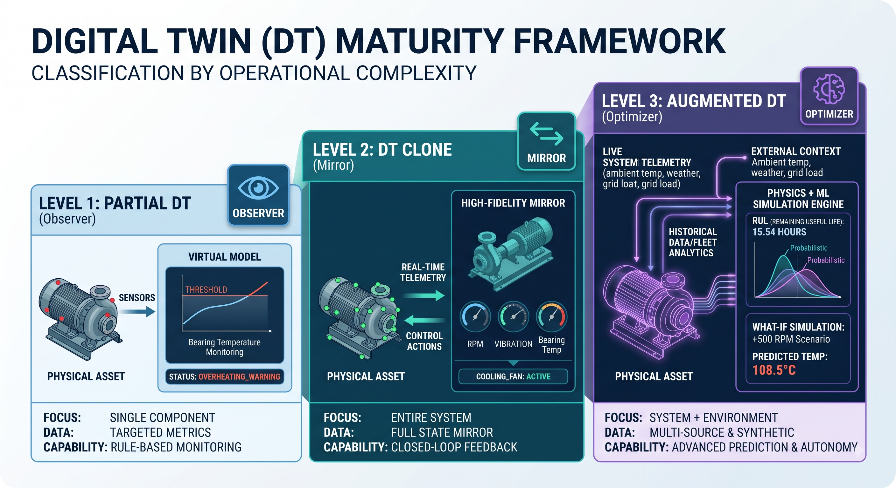

# Digital Twin Framework: Classification by Level of Maturity

This repository contains documentation, architectural blueprints, and conceptual models for classifying **Digital Twins (DT)** based on their **Level of Maturity**.

As cyber-physical systems evolve, virtual models progress from basic real-time mirrors to fully dynamic, multi-source augmented representations. This framework categorizes Digital Twins into three progressive maturity tiers: **Partial Digital Twin**, **Digital Twin Clone**, and **Augmented Digital Twin**.

## Maturity Spectrum Overview

| Maturity Level | Twin Type | Data Integration | Scope & Fidelity | Primary Capability |
| --- | --- | --- | --- | --- |
| **Level 1** | **Partial DT** | Single/Focused Data Streams | Focused component or subsystem | Focused monitoring & simple diagnostics |
| **Level 2** | **DT Clone** | Real-Time Dynamic Bi-directional | Full 1:1 physical entity reflection | High-fidelity simulation & state mirroring |
| **Level 3** | **Augmented DT** | Multi-Source, Physics + ML, Synthetic | Extended system + environmental context | Advanced prediction, what-if analysis, & autonomy |

## Detailed Level Classifications

### 1. Partial Digital Twin (Level 1)

A **Partial Digital Twin** represents a specific component, process, or targeted metric of a larger physical asset rather than the full system.

* **Characteristics:**
* Scope is constrained to isolated variables (e.g., monitoring temperature on a single bearing rather than an entire turbine).
* Relies on limited or intermittent sensor data feeds.
* Often unidirectional data flow (Physical $\rightarrow$ Digital).

* **Key Use Cases:**
* Component-level health monitoring.
* Rapid prototyping and initial proof-of-concept deployments.
* Non-critical asset tracking with low data sampling rates.

### 2. Digital Twin Clone (Level 2)

A **Digital Twin Clone** is an exact, high-fidelity virtual replica of a physical entity, continuously synchronized via real-time telemetry.

* **Characteristics:**
* Comprehensive 1:1 structural, kinematic, and operational mapping.
* Continuous, bi-directional data flow (Sensors $\rightarrow$ Twin $\rightarrow$ Actuators).
* Real-time state visualization and parameter synchronization.

* **Key Use Cases:**
* Live telemetry dashboards and remote operational control.
* Immediate fault detection and real-time operational auditing.
* Exact virtual commission testing prior to physical hardware changes.

### 3. Augmented Digital Twin (Level 3)

An **Augmented Digital Twin** extends beyond direct physical mirroring by integrating multi-source historical data, physics solvers, AI/ML models, and external environmental feeds.

* **Characteristics:**
* Fuses live telemetry with synthetic data, weather/ambient context, and cross-fleet analytics.
* Employs Machine Learning (e.g., Deep Reinforcement Learning, Time-Series Forecasting) and Reduced-Order Modeling (ROM).
* Evaluates unobservable parameters and probabilistic future states.

* **Key Use Cases:**
* Predictive Maintenance and Remaining Useful Life (RUL) estimation.
* Complex "What-If" scenario simulations under hypothetical extreme stress.
* Closed-loop autonomous optimization and adaptive control policy generation.

## A structured Digital Twin (DT) Maturity Framework

This image presents a structured Digital Twin (DT) Maturity Framework, categorizing virtual twin implementations into three distinct levels based on their operational complexity, data integration, and analytical depth.

This image presents a structured **Digital Twin (DT) Maturity Framework**, categorizing virtual twin implementations into three distinct levels based on their operational complexity, data integration, and analytical depth.

---

### Key Components Breakdown

#### Level 1: Partial DT (The Observer)

* **Role:** Focuses on single-component or isolated-subsystem monitoring.
* **Mechanism:** Ingests targeted metrics from specific physical sensors (e.g., bearing temperature) into a basic virtual model.
* **Capabilities:** Evaluates parameters against simple rule-based thresholds to issue alerts (e.g., displaying `STATUS: OVERHEATING_WARNING`).
* **Data Flow:** Unidirectional data flow from the physical asset to the virtual monitor.

#### Level 2: DT Clone (The Mirror)

* **Role:** Represents a 1:1 high-fidelity virtual replica of the entire physical asset.
* **Mechanism:** Maintains real-time state synchronization across all operational variables (e.g., RPM, vibration, and temperature).
* **Capabilities:** Facilitates bi-directional closed-loop control actions. When an operational threshold is crossed in the physical asset, the digital clone triggers real-time control adjustments back to the machine (e.g., toggling `COOLING_FAN: ACTIVE`).
* **Data Flow:** Bi-directional continuous telemetry and control feedback.

#### Level 3: Augmented DT (The Optimizer)

* **Role:** Integrates the physical system with contextual external environment data, machine learning engines, and physics models.
* **Mechanism:** Merges live system telemetry with ambient context (weather, ambient temperature, external grid load) and fleet historical data.
* **Capabilities:**
* **Predictive Maintenance:** Calculates Remaining Useful Life (RUL) using probabilistic models (e.g., `RUL: 15.54 HOURS`).
* **What-If Simulations:** Evaluates hypothetical operational scenarios (e.g., simulating a `+500 RPM` scenario to forecast a resulting temperature of `108.5°C`).

* **Data Flow:** Multi-source data fusion supporting closed-loop autonomous optimization.

### Core Progression Summary

| Level | Maturity Tier | Primary Scope | Primary Output |
| --- | --- | --- | --- |
| **Level 1** | **Partial DT** | Single Subsystem | Rule-based Monitoring & Alerts |
| **Level 2** | **DT Clone** | Entire Physical Asset | Real-time Mirroring & Closed-Loop Actuation |
| **Level 3** | **Augmented DT** | System + Environment Context | Predictive Analytics, RUL, & "What-If" Simulations |
