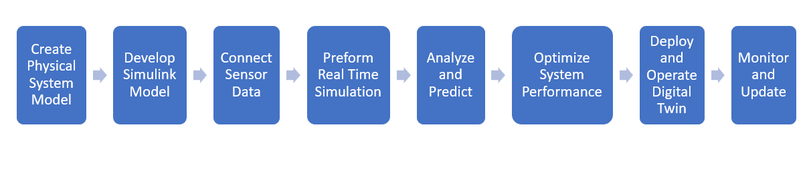

# Digital Twin Development Workflow in MATLAB

An end-to-end engineering pipeline for designing, calibrating, executing, and maintaining synchronized Digital Twins using the MATLAB® and Simulink® ecosystem.

## Process Flow

## 8-Stage Development Lifecycle

### 1. Create Physical System Model

Define the multi-domain physics and dynamic governing equations of the physical asset.

* **First-Principles Modeling:** Build mechanical, electrical, fluid, and thermal subsystems using **Simscape™**.

* **CAD & Multi-body Import:** Import 3D CAD assemblies into **Simscape Multibody™** to retain kinematic constraints and mass properties.

* **Component Parameterization:** Define physical coefficients (mass, friction, thermal conductivity, inductance).

### 2. Develop Simulink Model

Encapsulate control logic, boundary conditions, and signal interfaces around the physical plant model.

* **Block Diagram Design:** Construct closed-loop architectures in **Simulink®** combining controllers, plants, and environment models.

* **Model Order Reduction (MOR):** Create fast surrogate models or state-space approximations from compute-heavy dynamic systems using **System Identification Toolbox™**.

* **Interface Definition:** Establish standardized inputs, outputs, and internal bus structures.

### 3. Connect Sensor Data

Interface the virtual model with operational data streams for continuous synchronization.

* **Industrial Protocol Ingestion:** Connect to live telemetry streams using OPC UA, MQTT, Kafka, or Modbus blocks.

* **Sensor Fusion & State Estimation:** Implement Extended Kalman Filters (EKF) or Unscented Kalman Filters (UKF) to estimate unmeasurable internal states from noisy signals.

* **Signal Conditioning:** Apply digital filters and outlier rejection using **Signal Processing Toolbox™**.

### 4. Perform Real-Time Simulation

Execute the synchronized twin concurrently with the operating physical asset.

* **Hardware-in-the-Loop (HIL):** Run low-latency executions on real-time targets via **Simulink Real-Time™** and Speedgoat hardware.

* **Deterministic Solvers:** Configure fixed-step, real-time solvers to maintain strict timing synchronicity ($t_{\text{step}} \le \Delta t_{\text{sample}}$).

* **Parallel Execution:** Distribute multi-component co-simulations using **Parallel Computing Toolbox™**.

### 5. Analyze and Predict

Extract operational insights, diagnose anomalies, and forecast asset degradation.

* **Health Monitoring & Diagnostics:** Train classifiers and autoencoders in **Predictive Maintenance Toolbox™** to detect mechanical and electrical faults.

* **Prognostics (RUL Estimation):** Calculate Remaining Useful Life using exponential, degradation, and proportional hazard survival models.

* **What-If Scenario Exploration:** Inject transient fault parameters into the twin to evaluate failure modes safely.

### 6. Optimize System Performance

Enhance operating efficiency and update control setpoints based on predictive feedback.

* **Dynamic Parameter Optimization:** Tune controller gains and operational setpoints using **Simulink Design Optimization™**.

* **Prescriptive Logic:** Formulate Model Predictive Control (MPC) routines to maximize energy efficiency while respecting safety margins.

* **Multi-Objective Trade-Offs:** Balance throughput, thermal stress, and power consumption using **Optimization Toolbox™**.

### 7. Deploy and Operate Digital Twin

Package and export the digital twin runtime for deployment across edge devices or enterprise cloud platforms.

* **Embedded Edge Targets:** Generate ANSI/ISO C/C++ code via **Simulink Coder™** or **Embedded Coder®** for PLCs, industrial PCs, and edge controllers.

* **Cloud & Enterprise Microservices:** Compile models into Dockerized REST microservices deployed on **MATLAB Production Server™**.

* **Operator HMI:** Deploy interactive monitoring interfaces using **MATLAB Web App Server™**.

### 8. Monitor and Update

Maintain model fidelity and operational alignment across the asset's operating lifecycle.

* **Model Drift Tracking:** Continuously compare physical sensor measurements ($y_k$) against simulated outputs ($\hat{y}_k$).

* **Automated Recalibration:** Trigger parameter re-estimation workflows as components experience physical wear and tear.

* **Fleet Scale Synchronization:** Propagate updated baseline models and operational policies across entire asset fleets.
