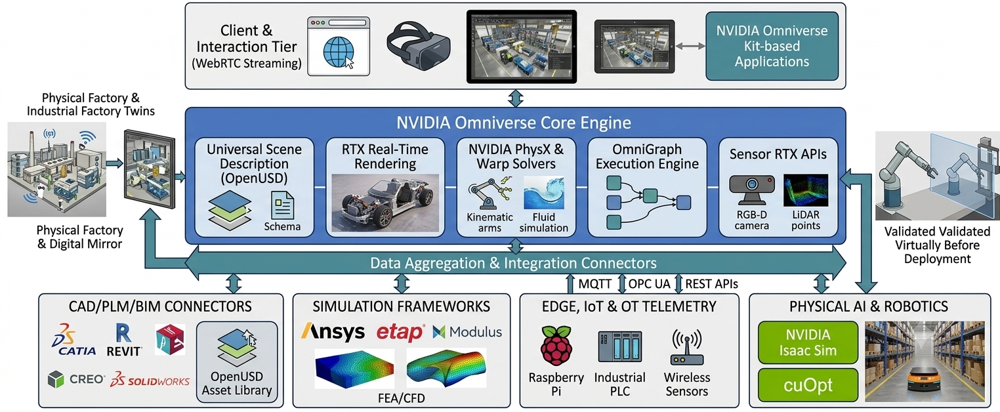

# NVIDIA Omniverse for Industrial Digital Twins & Physical AI

NVIDIA Omniverse is an open, extensible computing platform built on Universal Scene Description (OpenUSD) and accelerated by NVIDIA RTX technology. It provides modular libraries, physics engines, and cloud APIs to design, simulate, and operate physically accurate industrial digital twins, robotics environments, and factory-scale physical AI systems.

## Architecture Overview



This architecture diagram illustrates the complete, end-to-end framework of **NVIDIA Omniverse for Industrial Digital Twins & Physical AI**, structured into four distinct functional tiers:

### 1. Ingestion & Connectivity Layer (Bottom Tier)

This layer bridges disparate enterprise data sources, physical hardware, and specialized solvers into a unified digital pipeline via the **Data Aggregation & Integration Connectors**:

* **CAD / PLM / BIM Connectors:** Imports 3D design geometry and engineering metadata from standard tools like CATIA, Autodesk Revit, PTC Creo, and SolidWorks, standardizing them into an **OpenUSD Asset Library**.
* **Simulation Frameworks:** Interfaces with multi-physics solvers (e.g., Ansys, ETAP, and NVIDIA Modulus) to inject FEA (finite element analysis), CFD (computational fluid dynamics), and surrogate AI models into the scene.
* **Edge, IoT & OT Telemetry:** Ingests live telemetry from field devices—such as Raspberry Pi units, industrial PLCs (Siemens), and wireless sensors—using standard industrial protocols (**MQTT, OPC UA, REST APIs**).
* **Physical AI & Robotics:** Connects **NVIDIA Isaac Sim** (for synthetic data generation and robot perception/control training) and **NVIDIA cuOpt** (for route and logistics optimization).

---

### 2. NVIDIA Omniverse Core Engine (Middle Tier)

The central simulation and aggregation platform consisting of five modular engines:

* **Universal Scene Description (OpenUSD):** The foundational data schema that manages multi-layer scene composition, non-destructive editing, and cross-application interoperability.
* **RTX Real-Time Rendering:** Delivers real-time ray tracing and path tracing to produce physically accurate lighting, reflections, and material representations.
* **NVIDIA PhysX & Warp Solvers:** Computes rigid/soft body dynamics, collision envelopes, articulation trees for robotic arms, and fluid simulation.
* **OmniGraph Execution Engine:** A node-based visual programming system that handles event execution, data transformation, and logic binding inside the digital twin.
* **Sensor RTX APIs:** Simulates physical sensor streams—such as RGB-D cameras, LiDAR point clouds, and thermal sensors—enabling autonomy algorithms to run against virtual sensor data.

---

### 3. Client & Interaction Tier (Top Tier)

The user interface and presentation environment that enables distributed collaboration:

* **WebRTC Streaming:** Streams high-fidelity, interactive 3D sessions with low latency directly to lightweight web browsers and mobile tablets.
* **Extended Reality (XR):** Delivers immersive visualization to VR/AR headsets for virtual walkthroughs and teleoperation.
* **Omniverse Kit-based Applications:** Custom enterprise desktop applications built for domain-specific workflows, such as layout design, live asset monitoring, and operations control.

---

### 4. Closed-Loop Physical-to-Virtual Feedback (Side Loops)

The architecture establishes continuous closed-loop synchronization:

* **Physical Factory & Digital Mirror (Left):** Real-time telemetry from physical production assets continuously updates the digital twin, maintaining an accurate, synchronized live mirror of the plant floor.
* **Virtually Validated Before Deployment (Right):** Robot paths, assembly sequences, and control logic are tested and validated within the virtual twin before deployment to the physical factory floor, eliminating downtime and collision risks.

## Supported Digital Twin Paradigms

1. **Component & Asset Twins:** High-fidelity representations of individual machines, actuators, or robotic arms used for kinematic analysis, stress testing, and component-level anomaly diagnostics.
2. **System & Workcell Twins:** Synchronized multi-asset workcells (e.g., robotic welding, automated conveyor networks) to validate line balancing, cycle times, and dynamic collision envelopes.
3. **Facility & Factory Twins:** Macro-scale spatial models of manufacturing plants, distribution warehouses, and AI data centers. Enables layout planning, AMR routing, and thermal/airflow analysis.
4. **Geospatial & Smart Infrastructure Twins:** Large-scale environment models combining GIS, BIM, and live telematics for urban mobility, energy distribution, and civil infrastructure resilience.

---

## End-to-End Implementation Workflow


```

[1. Asset Ingestion] ──> [2. Physics & Kinematics] ──> [3. Sensor Simulation]
│
[6. WebRTC Deploy]   <── [5. AI & ROM Integration] <── [4. Telemetry Binding]

```

### Step 1: CAD/BIM Ingestion & OpenUSD Standardization
* Convert engineering assets from mechanical CAD/BIM ecosystems (e.g., Siemens NX, Autodesk Revit, PTC Creo, Dassault CATIA) using Omniverse Connectors.
* Construct an OpenUSD stage hierarchy utilizing non-destructive composition arcs (sublayers, references, payloads, and variants).

### Step 2: Physical & Kinematical Rigging
* Apply dynamic attributes using **NVIDIA PhysX** and **Omniverse Warp** (rigid bodies, mass matrices, collision meshes, surface friction).
* Define articulation trees, joint drive limits, and degrees of freedom (DoF) for robotics and mechanical assemblies.

### Step 3: Sensor Simulation Setup
* Configure synthetic perception sensors (RGB cameras, Depth, LiDAR, ultrasonic, thermal) using **Omniverse Sensor RTX APIs**.
* Generate annotated Synthetic Data (SDG) to train computer vision models and physical AI algorithms without risking real hardware.

### Step 4: Live Telemetry & Industrial Connectivity
* Connect real-time shop-floor data streams using standard protocols such as **OPC UA**, **MQTT**, **ROS 2**, or **REST APIs**.
* Bind runtime telemetry variables directly to OpenUSD scene attributes to synchronize the virtual twin with physical operations.

### Step 5: AI Surrogates & Optimization Integration
* Deploy Reduced-Order Models (ROMs) or Physics-Informed Neural Networks (PINNs via **NVIDIA Modulus**) to run sub-millisecond fluid, structural, or thermal simulations inside the twin.
* Connect **NVIDIA Isaac Sim** and **cuOpt** microservices to evaluate fleet path-planning and automated material handling against live telemetry.

### Step 6: Application Packaging & Streaming
* Build domain-specific extensions and microservices using **Omniverse Kit**.
* Distribute low-latency, photorealistic interactive sessions across web browsers, mobile displays, and XR headsets via **Omniverse WebRTC Streaming APIs**.

---

## Core Industrial Use Cases

| Industry Sector | Primary Applications |
| :--- | :--- |
| **Smart Manufacturing & Automotive** | Virtual factory layout planning, robotic workcell commissioning, and ergonomics simulation. |
| **Robotics & Autonomous Systems** | Synthetic data generation (SDG), hardware-in-the-loop (HIL) testing, and AMR fleet routing. |
| **Data Centers & Industrial Facilities** | Multi-physics thermal/airflow optimization (CFD surrogates) and power management. |
| **Aerospace & Heavy Industry** | Predictive maintenance scheduling, aerodynamic surface validation, and assembly sequencing. |
| **Civil & Infrastructure** | Traffic flow modeling, logistics hub optimization, and structural health monitoring. |

```
