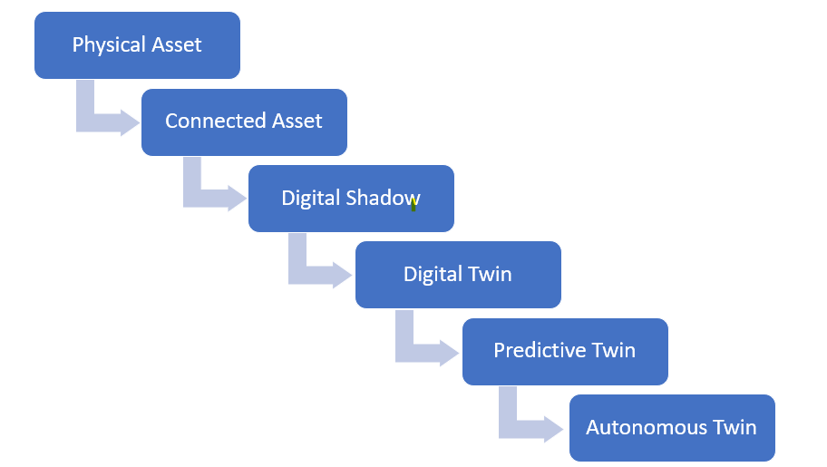

# 🚀 Digital Twin Maturity Journey

Welcome to the **Digital Twin Maturity Journey** repository. This guide details the progressive evolution of a physical system as it transitions from a standalone asset into a fully autonomous, self-optimizing Digital Twin.

## 📌 Table of Contents
1. [Overview](#-overview)
2. [Maturity Journey Roadmap](#-maturity-journey-roadmap)
3. [Stages of Digital Twin Maturity](#-stages-of-digital-twin-maturity)
4. [Maturity Progression Matrix](#-maturity-progression-matrix)
5. [Contributing](#-contributing)

## 📌 Overview

Adopting Digital Twin technology is an incremental process rather than a single deployment. As organizations integrate higher levels of IoT connectivity, real-time data synchronization, predictive modeling, and AI-driven automation, their digital capabilities progress through distinct maturity stages.

## 🛣️ Maturity Journey Roadmap

## 🪜 Stages of Digital Twin Maturity

### Stage 1: 🏭 Physical Asset
* **Description:** The standalone, un-networked physical object, machine, facility, or device operating in the real world.
* **Characteristics:** Operations rely entirely on manual inspections, periodic localized maintenance, and offline static engineering documentation (e.g., standard CAD drawings).

### Stage 2: 📡 Connected Asset
* **Description:** The physical asset is equipped with basic telemetry, IoT sensors, and network connectivity.
* **Characteristics:** Enables basic remote data capture and status monitoring, laying the infrastructural groundwork for continuous digital integration.

### Stage 3: 👤 Digital Shadow
* **Description:** A one-way automated data flow from the physical asset to the digital representation.
* **Characteristics:** Changes in the physical state are automatically updated in the digital model, providing continuous, real-time visibility without sending automated control signals back.

### Stage 4: 🔄 Digital Twin
* **Description:** A fully bi-directional automated data exchange between the physical asset and its virtual counterpart.
* **Characteristics:** Enables continuous real-time monitoring, simulation, and closed-loop remote control, allowing human operators or algorithms to issue control commands back to physical actuators.

### Stage 5: 🔮 Predictive Twin
* **Description:** Integration of advanced physics engines, machine learning, and historical analytics into the digital twin loop.
* **Characteristics:** Moves beyond current-state monitoring to forecast future equipment health, remaining useful life (RUL), and optimal operational parameters before failures occur.

### Stage 6: 🤖 Autonomous Twin
* **Description:** A highly intelligent, self-learning cyber-physical system capable of closed-loop automated decision-making.
* **Characteristics:** Leverages AI/ML algorithms (e.g., Deep Reinforcement Learning) to autonomously execute operational adjustments, self-heal, and optimize performance in real time with minimal to no human intervention.

## 📊 Maturity Progression Matrix

| Stage | Data Flow Direction | Primary Capability | Key Business Outcome |
| :--- | :--- | :--- | :--- |
| **1. Physical Asset** | None (Offline) | Physical operation | Core functional capability |
| **2. Connected Asset** | Manual / Periodic | Remote status checks | Basic telemetry visibility |
| **3. Digital Shadow** | One-Way Automated (Physical ➔ Digital) | Real-time monitoring | Continuous state awareness |
| **4. Digital Twin** | Bi-Directional Automated (Physical ⇄ Digital) | Closed-loop control & simulation | Real-time operational optimization |
| **5. Predictive Twin** | Bi-Directional + ML Models | Failure forecasting & RUL | Proactive, downtime-free maintenance |
| **6. Autonomous Twin** | Bi-Directional + Cognitive AI | Self-healing & dynamic tuning | Maximum efficiency & minimal intervention |
