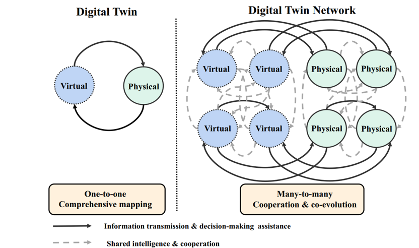

# 🌐 Digital Twin (DT) vs. Digital Twin Network (DTN)

Welcome to the **Digital Twin vs. Digital Twin Network** repository. This guide explores the paradigm shift from standalone cyber-physical representations (Digital Twins) to large-scale, interconnected multi-agent networks (Digital Twin Networks).

## 📌 Table of Contents

1. [Overview](https://www.google.com/search?q=%23-overview)
2. [Architectural Comparison Diagram](https://www.google.com/search?q=%23-architectural-comparison-diagram)
3. [Core Concepts](https://www.google.com/search?q=%23-core-concepts)
   
    * [Digital Twin (DT): One-to-One Mapping](https://www.google.com/search?q=%23digital-twin-dt-one-to-one-mapping)
    * [Digital Twin Network (DTN): Many-to-Many Co-Evolution](https://www.google.com/search?q=%23digital-twin-network-dtn-many-to-many-co-evolution)

4. [Data & Interaction Mechanics](https://www.google.com/search?q=%23-data--interaction-mechanics)
5. [Comparative Matrix](https://www.google.com/search?q=%23-comparative-matrix)
6. [Primary Use Cases](https://www.google.com/search?q=%23-primary-use-cases)

## 📌 Overview

While a standard **Digital Twin** focuses on modeling, monitoring, and optimizing an isolated physical asset, modern complex domains (such as smart cities, 6G wireless networks, and distributed smart grids) require multiple twins to interact dynamically. A **Digital Twin Network (DTN)** elevates this concept into an interconnected ecosystem, enabling collaborative decision-making, shared intelligence, and system-wide optimization.

## 📐 Architectural Comparison Diagram

## 🧩 Core Concepts

### Digital Twin (DT): One-to-One Mapping

* **Definition:** A localized, cyber-physical pairing focused on a single physical asset, machine, or discrete process.
* **Mechanism:** Establishes a direct, one-to-one comprehensive mapping between one physical entity and its designated virtual counterpart.
* **Scope:** Optimizes localized operational parameters, condition monitoring, and predictive maintenance for an individual asset.

### Digital Twin Network (DTN): Many-to-Many Co-Evolution

* **Definition:** A multi-layered, networked system of interconnected Digital Twins operating collaboratively.
* **Mechanism:** Enables a many-to-many cooperation framework where multiple physical nodes and multiple virtual nodes exchange real-time data, telemetry, and control signals concurrently.
* **Scope:** Facilitates global system-of-systems optimization, collective intelligence sharing, dynamic topology management, and cross-domain co-evolution.

## 🔄 Data & Interaction Mechanics

Communication in a Digital Twin Network occurs across two primary interaction layers:

1. **Information Transmission & Decision-Making Assistance (Solid Vectors):**
* Transmits real-time sensor streams and telemetry from physical nodes up to the virtual network domain.
* Routes AI/ML-driven decision-making assistance, optimized setpoints, and automated control signals back from the virtual space down to physical assets.

2. **Shared Intelligence & Cooperation (Dashed Vectors):**
* Establishes horizontal peer-to-peer data sharing among physical assets (e.g., V2V vehicle-to-vehicle communication, sensor mesh networks).
* Enables cross-layer cooperative learning, distributed AI/Federated Learning, and collaborative simulations across virtual nodes in the digital space.

## 📊 Comparative Matrix

| Characteristic | Digital Twin (DT) | Digital Twin Network (DTN) |
| --- | --- | --- |
| **Mapping Topology** | **One-to-one** comprehensive mapping | **Many-to-many** cooperation & co-evolution |
| **Operational Scope** | Single asset / isolated component | System of Systems (SoS) / large-scale network |
| **Data Exchange** | Vertical bi-directional loop | Vertical control loop + Horizontal peer cooperation |
| **Intelligence Model** | Localized model & analytics engine | Distributed AI, shared intelligence & federated learning |
| **Primary Focus** | Component health, RUL, asset tuning | Topology control, global load balancing, swarm optimization |
| **Resilience & Scalability** | Bound to the performance of a single twin | High fault tolerance, dynamic topology scaling, and redundancy |

## 💡 Primary Use Cases

* **Smart Cities & Urban Mobility:** Interconnecting connected vehicles (V2X), traffic management twins, energy grids, and emergency response services into a unified network twin.
* **6G & Wireless Networks:** Modeling radio access networks (RAN), edge nodes, core routers, and mobile users to dynamically optimize bandwidth allocation, beamforming, and network slicing.
* **Smart Industrial Grids & Logistics:** Coordinating multiple automated guided vehicles (AGVs), robotic arms, and supply chain nodes across connected smart factories.
* **Healthcare & WBAN Networks:** Networked wireless body area network (WBAN) sensors communicating with hospital digital twins for continuous patient population tracking.
