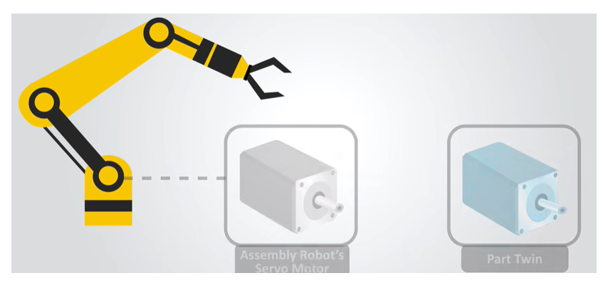
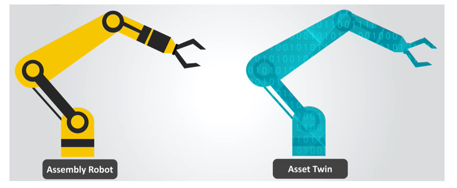
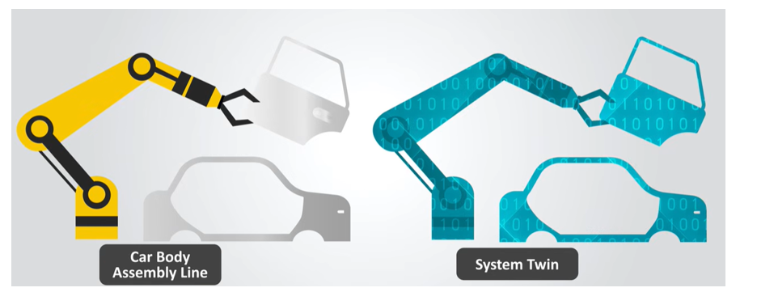
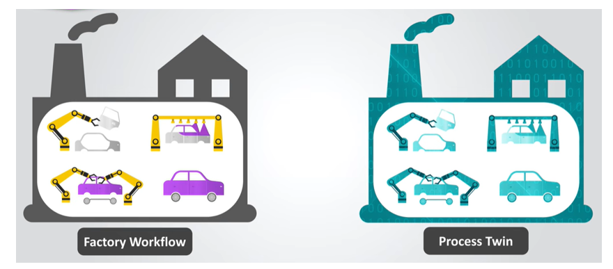

# 🏷️ Digital Twin Classification: Hierarchical Framework

Welcome to the **Digital Twin Classification** repository. This guide provides an architectural overview of how Digital Twins are categorized from a **Hierarchical Point of View**, scaling from discrete, single-part components up to full-scale enterprise ecosystems.

## 📌 Table of Contents

1. [Overview](https://www.google.com/search?q=%23-overview)
2. [Hierarchical Architecture Diagram](https://www.google.com/search?q=%23-hierarchical-architecture-diagram)
3. [The 5 Hierarchical Levels](https://www.google.com/search?q=%23-the-5-hierarchical-levels)
* [1. Component / Unit / Part Twin](https://www.google.com/search?q=%231-component--unit--part-twin)
* [2. Asset Twin](https://www.google.com/search?q=%232-asset-twin)
* [3. System Twin](https://www.google.com/search?q=%233-system-twin)
* [4. Process Twin](https://www.google.com/search?q=%234-process-twin)
* [5. Enterprise Twin](https://www.google.com/search?q=%235-enterprise-twin)


4. [Summary Matrix](https://www.google.com/search?q=%23-summary-matrix)

## 📌 Overview

From a hierarchical perspective, Digital Twin implementations scale in complexity, data integration, and operational scope. By structuring twins into hierarchical tiers—from an individual component or motor to an entire enterprise network—organizations can systematically build, interlink, and manage cyber-physical systems across all operational layers.


## 📐 Hierarchical Architecture Diagram

```
                       ┌─────────────────────────┐
                       │     Enterprise Twin     │  <-- Multi-Site & Business Scope
                       └────────────┬────────────┘
                                    │
                       ┌────────────┴────────────┐
                       │      Process Twin       │  <-- Workflow & Production Operations
                       └────────────┬────────────┘
                                    │
                       ┌────────────┴────────────┐
                       │       System Twin       │  <-- Integrated Equipment Workcells
                       └────────────┬────────────┘
                                    │
                       ┌────────────┴────────────┐
                       │       Asset Twin        │  <-- Discrete Machines & Equipment
                       └────────────┬────────────┘
                                    │
                       ┌────────────┴────────────┐
                       │  Component / Part Twin  │  <-- Sub-Assemblies & Sensors
                       └─────────────────────────┘

```

---

## 🧩 The 5 Hierarchical Levels

### 1. ⚙️ Component / Unit / Part Twin

* **Definition:** The lowest level of the digital twin hierarchy, focusing on a single physical part, component, or critical sub-assembly (e.g., an electric motor, bearing, pump, or valve).
* **Key Focus:** Telemetry monitoring, stress analysis, material fatigue, and component-level health diagnostics.



  * **The Larger Physical System (Assembly Robot):** On the left is an industrial robotic arm. Rather than modeling the entire robot, this specific application isolates a single critical sub-component.

  * **The Target Physical Part (Assembly Robot's Servo Motor):** A dashed line isolates the servo motor driving one of the robot's joints. This represents the physical entity whose telemetry (e.g., rotor speed, temperature, torque, vibration) is being captured.

  * **The Part Twin (Virtual Model):** On the right is the 3D digital model ("Part Twin") that mirrors the real-world servo motor.

  ### 💡 Core Concept & Purpose

  * **Localized Focus:** A Part Twin concentrates strictly on monitoring the health and performance of an individual component rather than the overall process or system.

  * **Predictive Maintenance:** By creating a virtual model of just the servo motor, engineers can monitor parameters like thermal stress, bearing friction, and mechanical fatigue in real time.

  * **Early Fault Detection:** Isolating a part twin allows system operators to detect component failure early—enabling component replacement before it damages the larger assembly robot or halts an entire manufacturing line.


### 2. 🏭 Asset Twin

* **Definition:** Combines multiple component twins to represent a complete physical machine, piece of equipment, or asset (e.g., a robotic arm, CNC machine, or wind turbine).
* **Key Focus:** Asset performance, operational efficiency, remaining useful life (RUL), and predictive maintenance.



* **Physical Asset (Assembly Robot):** On the left is a complete physical industrial piece of machinery—an assembly robotic arm composed of multiple joints, motors, linkages, and end-effectors.

* **Asset Twin (Virtual Model):** On the right is the full 3D digital representation overlaid with binary code elements. It models the entire physical robot as a single integrated unit rather than focusing on just an isolated motor.

### 💡 Core Concept & Purpose

* **Systemic Representation:** Unlike a **Part Twin** (which tracks only a single motor or bearing), an **Asset Twin** monitors how all sub-components function together as a complete machine.

* **Multi-Sensor Integration:** Telemetry from all joints, actuators, and sensors across the robotic arm feeds into this single virtual model to reflect the robot's real-time kinematic state, joint angles, and overall payload status.

* **Operational Performance & RUL:** It allows engineers to monitor overall equipment effectiveness (OEE), calculate the Remaining Useful Life (RUL) of the entire machine, and optimize motion paths to prevent mechanical strain.

### 3. ⚙️ System Twin

* **Definition:** Integrates multiple asset twins to model an interconnected group of equipment operating together as a unified system or workcell (e.g., an automated vehicle assembly line or power substation).
* **Key Focus:** Inter-asset interaction, workload balancing, edge controller synchronization, and throughput optimization.



### 🔍 Key Components Shown

* **Physical System (Car Body Assembly Line):** On the left is an interconnected manufacturing cell featuring an robotic arm actively assembling a door onto a car body chassis.

* **System Twin (Virtual Model):** On the right is the digital representation overlaid with binary code elements. It mirrors the entire workcell—modeling the robotic arm, the vehicle chassis, the sub-components, and their real-time physical interactions simultaneously.

### 💡 Core Concept & Purpose

* **Multi-Asset Coordination:** While an **Asset Twin** monitors a single standalone robot, a **System Twin** tracks how multiple independent entities (e.g., the robot arm, the car body chassis, and conveyor mechanisms) interact collaboratively within a shared physical environment.

* **Inter-Entity Optimization:** Real-time telemetry from all connected equipment feeds into this digital model to synchronize timing, align spatial tolerances (e.g., precise door fitting), and prevent physical collisions during automated operations.

* **Line Bottleneck Elimination:** It enables operators to optimize throughput across the workcell, balance operational loads, and adjust cycle times dynamically to keep the broader assembly line moving seamlessly.

### 4. 🔄 Process Twin

* **Definition:** Models the broader operational workflows, manufacturing processes, or facility-wide logistics that bind systems together (e.g., an entire manufacturing plant process, supply chain flow, or refinery operation).
  
* **Key Focus:** End-to-end process efficiency, bottleneck identification, energy management, and production line balancing.

* * **Macro-Level Focus:** It models how multiple **System Twins** and **Asset Twins** interact sequentially over time across a full manufacturing line, plant, or facility.

* **Flow & Sequence Analysis:** It monitors parameters like cycle times, material flow rates, energy consumption, and line throughput across different stages of production.



### 💡 Core Purpose & Key Use Cases

* **End-to-End Workflow Optimization:** Identifies macro-level bottlenecks, delays, and capacity mismatches across multi-stage operations (e.g., stamping $\rightarrow$ welding $\rightarrow$ painting $\rightarrow$ final assembly in automotive plants).

* **Scenario Modeling & "What-If" Analysis:** Allows plant engineers to simulate changes in production schedules, batch sizes, or line reconfigurations in the virtual environment without disrupting active operations.

* **Resource & Yield Optimization:** Fine-tunes raw material usage, labor allocation, and energy efficiency across the entire production line to maximize overall operational yield.

### 5. 🌐 Enterprise Twin

* **Definition:** The highest level of the hierarchy, integrating process, system, and asset twins across the entire organization, multiple facilities, and business operations.

* **Key Focus:** Strategic business optimization, global supply chain resilience, enterprise-wide resource allocation, and executive decision-making.


* **Automaker’s Global Ecosystem (Left):** Shows interconnected manufacturing facilities and industrial sites distributed across the globe (North America, South America, Europe, Africa, Asia, and Australia). These facilities communicate via an **IoT (Internet of Things)** network, collecting operational data, sensor inputs, and telemetry from manufacturing lines worldwide.
  
* **Enterprise Twin (Right):** Represents the digital counterpart (or Digital Twin) of the global ecosystem. It aggregates real-time data streams from the IoT network onto a centralized digital dashboard displaying metrics, analytics, status progress bars, and data trends. This enables enterprise-level monitoring, simulation, optimization, and real-time updating across all connected facilities.


## 📊 Summary Matrix

| Hierarchical Level | Scope / Target | Core Technologies | Primary Objective |
| --- | --- | --- | --- |
| **Component / Part Twin** | Discrete part or sub-assembly | FEA, vibration/thermal sensors | Structural integrity & fault detection |
| **Asset Twin** | Complete standalone equipment | Edge telemetry, CAD, physics models | Predictive maintenance & asset health |
| **System Twin** | Multi-asset workcell / line | Edge controllers, SCADA, IoT mesh | Inter-machine sync & workcell output |
| **Process Twin** | Facility-wide manufacturing/flow | Cloud analytics, ERP integration | Bottleneck elimination & yield tuning |
| **Enterprise Twin** | Multi-site network & business | Cloud computing, Distributed AI, BI | Global resource & strategic optimization |


